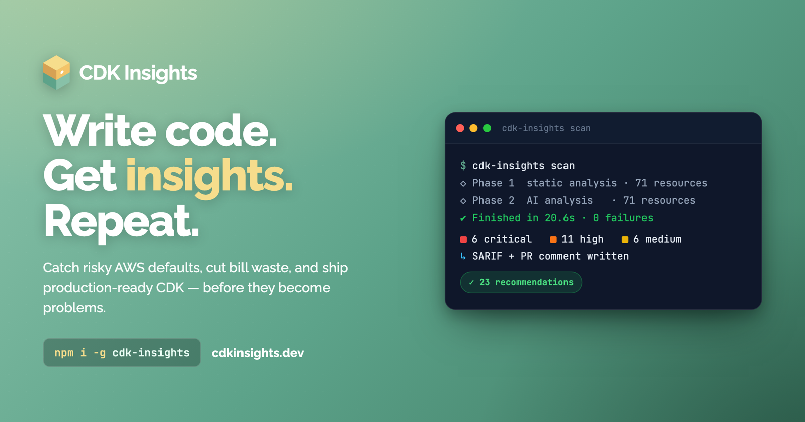

<p align="center">
  <a href="https://cdkinsights.dev/?utm_source=github-action&utm_medium=readme&utm_campaign=marketplace">
    
  </a>
</p>

# CDK Insights GitHub Action

<p align="center">
  <a href="https://github.com/marketplace/actions/cdk-insights"></a>
  <a href="https://github.com/instancelabs/cdk-insights-action/actions/workflows/ci.yml"></a>
  <a href="./LICENSE"></a>
</p>

Static and AI-powered analysis for AWS CDK — runs `cdk-insights scan` against your synthesized stacks and surfaces findings as PR comments, GitHub Code Scanning alerts, and downloadable reports.

> **Requires `cdk-insights` >= 1.44.1.** The CLI is installed automatically (`latest` by default), so no action is needed unless you pin an older version via `cdk-insights-version`. On older CLIs the action still runs but with reduced functionality — single-pass reports, the `fail-on-class` gate, and `stack-name` scoping all depend on 1.44.1+.

## Features

- **100+ rules across 35+ AWS services** — security misconfigurations, cost waste, reliability gaps, and Well-Architected Framework pillar violations
- **AI-powered recommendations** — context-aware analysis via AWS Bedrock (requires a CDK Insights account; 500 free credits/month or paid tier)
- **PR comments** — severity-bucketed summary posted on pull requests via `gh` CLI
- **GitHub Code Scanning** — SARIF generated and auto-uploaded to the Security tab
- **Report artifacts** — JSON, SARIF, and markdown reports persisted as downloadable workflow artifacts
- **Per-pillar fail gating** — fail the build on Security findings only (default), or opt into Reliability / Cost / etc.
- **Per-class fail gating** — block on `security` / `compliance` findings while best-practice advice stays advisory, independent of severity (`fail-on-class`)
- **Single-pass reports** — with `cdk-insights >= 1.44.1` the JSON, SARIF, and Markdown reports are produced from one scan (no duplicate analysis or scan-history upload)
- **CLI caching** — the `cdk-insights` npm package is cached via `@actions/tool-cache`, so subsequent runs skip the install step

## Quick Start

```yaml
name: CDK Insights
on: [pull_request]

jobs:
  analyze:
    runs-on: ubuntu-latest
    permissions:
      contents: read
      pull-requests: write  # Required for PR comments

    steps:
      - uses: actions/checkout@v4

      - name: Setup Node.js
        uses: actions/setup-node@v4
        with:
          node-version: '20'

      - name: Install dependencies
        run: npm ci

      - name: CDK Insights Analysis
        uses: instancelabs/cdk-insights-action@v1
        with:
          license-key: ${{ secrets.CDK_INSIGHTS_LICENSE_KEY }}
          ai-analysis: true
```

## Inputs

| Input | Description | Required | Default |
|-------|-------------|----------|---------|
| `license-key` | CDK Insights license key. Required for AI analysis. Free, Pro, and Team license keys are all supported — quotas are enforced server-side. | No | - |
| `working-directory` | Directory containing the CDK project (validated to stay inside `GITHUB_WORKSPACE`). | No | `.` |
| `stack-name` | Specific stack to analyze. Omit to analyze every stack (`--all`). | No | (all stacks) |
| `ai-analysis` | Enable AI-powered recommendations. Requires `license-key`. Set to `false` with a license key to pass `--local` and force static-only analysis. | No | `false` |
| `fail-on` | Fail workflow on severity levels (comma-separated: `critical,high,medium,low`). Omit to fail on any finding within `fail-on-pillars` scope. | No | - |
| `fail-on-pillars` | Which Well-Architected pillars count toward `fail-on`. Comma-separated list of `security`, `reliability`, `cost optimization`, `operational excellence`, `performance efficiency`, `sustainability`, or the shorthand `all`. Findings from other pillars are still reported but won't block the deploy. | No | `security` |
| `fail-on-class` | Fail the build on findings of these **classes**, regardless of severity or pillar. Comma-separated list of `security`, `best-practice`, `compliance`. Orthogonal to `fail-on` / `fail-on-pillars` — block on real risk while best-practice advice stays advisory. Requires `cdk-insights >= 1.44.1`; older CLIs emit no class data, so the gate is a no-op. | No | (off) |
| `pr-comment` | Post analysis summary as a PR comment (uses the `gh` CLI, authenticated via the workflow's `GITHUB_TOKEN`). | No | `true` |
| `sarif-upload` | Generate SARIF and auto-upload to GitHub Code Scanning. Requires `security-events: write`. | No | `false` |
| `upload-artifact` | Upload JSON, SARIF, and markdown report files as a workflow artifact. | No | `true` |
| `artifact-name` | Name for the uploaded artifact. | No | `cdk-insights-report` |
| `github-token` | Token used for SARIF upload to Code Scanning. | No | `${{ github.token }}` |
| `services` | Filter analysis to specific AWS services (comma-separated, e.g. `S3,Lambda,IAM`). | No | (all services) |
| `rule-filter` | Filter to specific rules (comma-separated rule IDs). | No | - |
| `cdk-insights-version` | npm version of `cdk-insights` to install. Use `latest` or a semver string. Minimum supported: `1.44.1`. | No | `latest` |

## Outputs

| Output | Description |
|--------|-------------|
| `total-issues` | Total number of issues found across every pillar |
| `critical-count` | Number of critical issues (full totals — not pillar-filtered) |
| `high-count` | Number of high severity issues |
| `medium-count` | Number of medium severity issues |
| `low-count` | Number of low severity issues |
| `sarif-file` | Comma-separated paths to generated SARIF file(s) |
| `json-file` | Comma-separated paths to JSON results file(s) |
| `artifact-id` | ID of the uploaded artifact (omitted if `upload-artifact: false`) |
| `exit-code` | `1` if any finding within `fail-on-pillars` matches `fail-on`, or any finding matches `fail-on-class`; otherwise `0` |

> Severity outputs always reflect **full totals** so PR comments and downstream badges never hide findings. The fail-on gate uses pillar-filtered counts internally.

## Examples

### Static Analysis (No License)

100+ rules with PR comments — no signup required:

```yaml
- uses: instancelabs/cdk-insights-action@v1
```

### AI-Powered Analysis

Enable Bedrock-backed recommendations. Works on any tier with a license key — Free accounts get 500 AI insights/month, Pro gets 5,000/month, Team gets 10,000 per seat:

```yaml
- uses: instancelabs/cdk-insights-action@v1
  with:
    license-key: ${{ secrets.CDK_INSIGHTS_LICENSE_KEY }}
    ai-analysis: true
```

### Static-Only with License Key

Force static analysis even when a license key is present (passes `--local` to the CLI, preserving your AI credits):

```yaml
- uses: instancelabs/cdk-insights-action@v1
  with:
    license-key: ${{ secrets.CDK_INSIGHTS_LICENSE_KEY }}
    ai-analysis: false
```

### Fail on Critical/High Security Issues

By default the action only fails on **Security** pillar findings. To block merges on critical or high severity security issues:

```yaml
- uses: instancelabs/cdk-insights-action@v1
  with:
    license-key: ${{ secrets.CDK_INSIGHTS_LICENSE_KEY }}
    ai-analysis: true
    fail-on: critical,high
```

### Gate on Multiple Well-Architected Pillars

Include Reliability and Cost findings in the fail-on gate (otherwise they're reported but non-blocking):

```yaml
- uses: instancelabs/cdk-insights-action@v1
  with:
    license-key: ${{ secrets.CDK_INSIGHTS_LICENSE_KEY }}
    fail-on: critical,high
    fail-on-pillars: security,reliability,cost optimization
```

Or fail on any pillar:

```yaml
- uses: instancelabs/cdk-insights-action@v1
  with:
    fail-on: critical
    fail-on-pillars: all
```

### Specific Stack

Analyze only a specific CDK stack:

```yaml
- uses: instancelabs/cdk-insights-action@v1
  with:
    stack-name: ProductionStack
```

### GitHub Code Scanning (SARIF)

When `sarif-upload: true`, the action automatically generates SARIF files and uploads them to GitHub's Security tab — no extra steps needed:

```yaml
jobs:
  analyze:
    runs-on: ubuntu-latest
    permissions:
      contents: read
      pull-requests: write
      security-events: write  # Required for SARIF upload

    steps:
      - uses: actions/checkout@v4
      - uses: actions/setup-node@v4
        with:
          node-version: '20'
      - run: npm ci

      - uses: instancelabs/cdk-insights-action@v1
        with:
          license-key: ${{ secrets.CDK_INSIGHTS_LICENSE_KEY }}
          sarif-upload: true
          fail-on: critical,high
```

> **Note:** SARIF upload to the Security tab requires Code Scanning to be enabled on the repository. This is free for public repos. Private repos require GitHub Advanced Security.

### Report Artifacts

By default (`upload-artifact: true`), all report files are uploaded as a downloadable GitHub artifact. This includes JSON, SARIF, and markdown reports. You can find them in the workflow run summary under "Artifacts".

To customize the artifact name:

```yaml
- uses: instancelabs/cdk-insights-action@v1
  with:
    artifact-name: security-report
```

To disable artifact upload:

```yaml
- uses: instancelabs/cdk-insights-action@v1
  with:
    upload-artifact: false
```

### Full Example

A complete workflow with all features enabled:

```yaml
name: CDK Insights Analysis
on:
  pull_request:
    branches: [main]
    paths:
      - 'lib/**'
      - 'bin/**'
      - 'cdk.json'

jobs:
  analyze:
    runs-on: ubuntu-latest
    permissions:
      contents: read
      pull-requests: write
      security-events: write

    steps:
      - uses: actions/checkout@v4

      - name: Setup Node.js
        uses: actions/setup-node@v4
        with:
          node-version: '20'
          cache: 'npm'

      - name: Install dependencies
        run: npm ci

      - name: CDK Insights Analysis
        id: analysis
        uses: instancelabs/cdk-insights-action@v1
        with:
          license-key: ${{ secrets.CDK_INSIGHTS_LICENSE_KEY }}
          ai-analysis: true
          fail-on: critical,high
          fail-on-pillars: security
          pr-comment: true
          sarif-upload: true
          upload-artifact: true
          artifact-name: cdk-insights-report
```

This will:
1. Analyze all CDK stacks with AI-powered recommendations
2. Post a severity-bucketed summary as a PR comment
3. Upload SARIF results to the GitHub Security tab
4. Persist JSON, SARIF, and markdown reports as downloadable artifacts
5. Fail the workflow if any **Security** finding is critical or high (other pillars are reported but non-blocking)

### Monorepo with Multiple CDK Projects

```yaml
jobs:
  analyze:
    runs-on: ubuntu-latest
    strategy:
      matrix:
        project: [backend, frontend-api, data-pipeline]

    steps:
      - uses: actions/checkout@v4

      - uses: instancelabs/cdk-insights-action@v1
        with:
          working-directory: packages/${{ matrix.project }}
          artifact-name: cdk-insights-${{ matrix.project }}
          license-key: ${{ secrets.CDK_INSIGHTS_LICENSE_KEY }}
```

### Using Outputs in Subsequent Steps

```yaml
- uses: instancelabs/cdk-insights-action@v1
  id: analysis
  with:
    license-key: ${{ secrets.CDK_INSIGHTS_LICENSE_KEY }}

- name: Check results
  run: |
    echo "Total issues: ${{ steps.analysis.outputs.total-issues }}"
    echo "Critical: ${{ steps.analysis.outputs.critical-count }}"
    echo "Artifact ID: ${{ steps.analysis.outputs.artifact-id }}"

    if [ "${{ steps.analysis.outputs.critical-count }}" -gt "0" ]; then
      echo "::warning::Critical issues found!"
    fi
```

### Filter by AWS Services

```yaml
- uses: instancelabs/cdk-insights-action@v1
  with:
    services: S3,Lambda,DynamoDB,IAM
```

## Permissions

The action requires different permissions depending on features used:

```yaml
permissions:
  contents: read          # Always required
  pull-requests: write    # Required for PR comments
  security-events: write  # Required for SARIF upload to Code Scanning
```

| Permission | Required For | When to Add |
|------------|-------------|-------------|
| `contents: read` | Checking out code | Always |
| `pull-requests: write` | PR comments | When `pr-comment: true` (default) |
| `security-events: write` | SARIF upload to Security tab | When `sarif-upload: true` |

> **Note:** Artifact upload uses the default `GITHUB_TOKEN` permissions and does not require additional permissions.

## Environment Variables

The full workflow environment is forwarded to the `cdk-insights` CLI subprocess, so anything a `cdk synth` needs at runtime — AWS credentials, region, project config — works out of the box:

- `AWS_REGION`, `AWS_ACCESS_KEY_ID`, `AWS_SECRET_ACCESS_KEY`, `AWS_SESSION_TOKEN` (for SDK lookups during synth)
- `CDK_DEFAULT_ACCOUNT`, `CDK_DEFAULT_REGION` (for environment-targeted stacks)
- Any project-specific vars your CDK app reads (e.g. `STAGE`, dotenv-loaded config)

The action sets `CI=true` and `CDK_INSIGHTS_LICENSE_KEY` (when `license-key` is provided) on top of the inherited env. License keys are masked via `core.setSecret()` so they never appear in logs.

If your CDK app needs AWS credentials at synth time, configure them with [`aws-actions/configure-aws-credentials`](https://github.com/aws-actions/configure-aws-credentials) before this action — ideally via OIDC, not long-lived keys.

## PR Comment Example

When `pr-comment: true` (default), the action posts a summary like:

> ## CDK Insights Analysis
>
> **Stack:** MyStack | **Resources:** 47 | **Issues:** 19 | **Analysis:** AI-powered
>
> ### Summary by Severity
>
> | Severity | Count |
> |----------|-------|
> | Critical | 2 |
> | High | 5 |
> | Medium | 12 |
>
> ### Top Issues
>
> 1. **S3 bucket without encryption** (Critical)
>    `MyStack/DataBucket` - Enable server-side encryption
>
> 2. **Lambda without DLQ** (High)
>    `MyStack/ProcessorFunction` - Add dead-letter queue
>
> <details>
> <summary>View all 19 issues</summary>
> ...
> </details>

## Pricing

| Plan | Price | What's Included |
|------|-------|-----------------|
| **Free** (no signup) | £0 | Static analysis (100+ rules), JSON/Table/Markdown/SARIF output, multi-stack analysis |
| **Free** (signed-up) | £0 | Everything above + 500 AI insights/month (Nova Lite) |
| **Pro** | £9.99/mo | Everything in Free + full AI analysis (Bedrock), dashboard, PDF reports, **5,000 AI insights/month** |
| **Team** | £12.99/seat/mo (2-seat minimum) | Everything in Pro + team management, shared configs, audit trails, **10,000 AI insights per seat** |

Static analysis is **free forever** — no signup, no credit card. AI analysis requires a license key (free account or paid). Usage beyond the included monthly insights is billed per-credit on Pro/Team.

[View full pricing at cdkinsights.dev](https://cdkinsights.dev/pricing)

## Support

- Documentation: [cdkinsights.dev/docs](https://cdkinsights.dev/docs)
- Issues: [github.com/instancelabs/cdk-insights-action/issues](https://github.com/instancelabs/cdk-insights-action/issues)
- Email: support@cdkinsights.dev

## License

MIT
